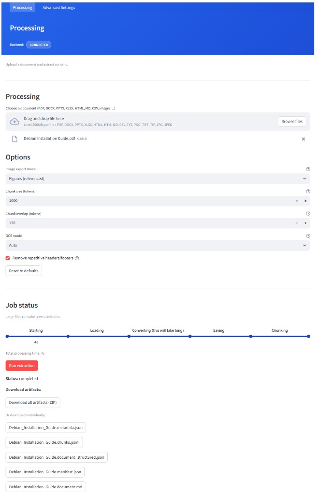

# Doclinger

**Repository:** [Doclinger](https://github.com/divertom/Doclinger)

## Introduction

Doclinger is a **ready-to-go Docling installation with a web UI** for easy document processing and **RAG agent ingestion**. Upload PDFs, Office docs, or images; configure chunk size and overlap, OCR, and cleanup options; run extraction; then download markdown and RAG-ready JSONL chunks. All local—no cloud required.



## Prerequisites

- **Docker** (recommended): Docker Engine and Docker Compose. The image uses Python 3.11 and includes Docling.
- **Local run**: Python 3.11+, pip, and a virtual environment. Docling is optional locally (placeholder extraction if not installed).

## Features

- **Upload**: PDF, DOCX, PPTX, XLSX, HTML, Markdown, CSV, images (PNG, TIFF, JPG), and more (limit 200MB per file)
- **Extract**: Run **Docling** extraction (Docker image includes Docling; local runs use placeholder if not installed)
- **Store**: Structured outputs with a **prefix** derived from the source filename (e.g. `User_Guide_v2.document.md`, `User_Guide_v2.chunks.jsonl`, `User_Guide_v2.metadata.json`)
- **Chunk**: Header-aware, token-sized chunking (default 1000 tokens, 120 overlap) into lean JSONL for RAG ingestion
- **Preview & download**: View extraction and chunks in the UI; download artifacts via buttons

## Tech Stack

- **Backend**: FastAPI, Uvicorn, Pydantic, Docling (or placeholder)
- **UI**: Streamlit, requests
- **Container**: Docker + docker-compose

## Project Layout

```
Doclinger/                 # project root (clone as Doclinger or rename as you like)
├── README.md
├── docs/
│   └── processing-ui.png  # screenshot for README
├── .gitignore
├── .dockerignore
├── docker/
│   ├── Dockerfile
│   ├── docker-compose.yml
│   └── entrypoint.sh      # starts backend then Streamlit
├── scripts/
│   └── prevent-sleep.ps1   # Windows: keep PC awake during extraction
├── backend/
│   ├── pyproject.toml
│   ├── requirements.txt
│   └── src/app/
│       ├── main.py
│       ├── api/            # routes: upload, extract, job, artifact, storage
│       ├── core/           # config, models, docling_runner, chunker, storage
│       └── tests/
├── ui/
│   ├── streamlit_app.py
│   ├── run.ps1             # Windows: run Streamlit with project venv
│   └── components/
├── data/                   # created at runtime if missing
│   ├── uploads/
│   ├── outputs/
│   └── examples/
```

## Quick Start

### Docker (recommended)

Build and run the container. Ports are configurable via environment variables (defaults: API **8001**, UI **8502**).

**Configure ports (optional):**

Ports can be customized via environment variables. Copy `.env.example` to `.env` and adjust as needed, or set environment variables directly:

```bash
# .env (copy from .env.example)
API_PORT=8001
UI_PORT=8502
```

**Start the services:**

```bash
cd Doclinger/docker
docker compose up --build -d
```

Or from project root:

```bash
cd Doclinger
docker compose -f docker/docker-compose.yml up --build -d
```

| Service    | URL (default ports) |
|------------|---------------------|
| **UI**     | http://localhost:8502 |
| **API**    | http://localhost:8001 |
| **API docs** | http://localhost:8001/docs |

Ports are configurable via `API_PORT` and `UI_PORT` environment variables (see `.env.example`).

To stop the stack: `docker compose -f docker/docker-compose.yml down` (from project root). Data in `data/` is kept.

**Using the Docker UI:** Open http://localhost:8502 (or your configured `UI_PORT`). The sidebar uses **http://127.0.0.1:8000** by default (API inside the same container). Leave it as is when using the Docker UI.

**Optional — split backend and UI (dev profile):** For development you can run the API and Streamlit as separate containers so you can mount only the `ui/` folder:

```bash
docker compose -f docker/docker-compose.yml --profile dev up -d backend-only ui-only
```

Configure dev ports via `API_PORT_DEV` and `UI_PORT_DEV` environment variables (defaults: 8002 and 8503). The UI talks to the API at http://backend-only:8000 inside the network.

1. Upload a file, then click **Run extraction**.
2. Wait for the progress timer (large PDFs can take 3–5 minutes).
3. When extraction finishes, use **Download** buttons under Job status for the document and chunk artifacts (filenames are prefixed with the sanitized source name, e.g. `My_Report.document.md`, `My_Report.chunks.jsonl`).

### Local (Python 3.11+)

1. From the project root, create a virtual environment and install dependencies:

   ```bash
   cd Doclinger
   python -m venv Docling
   # Windows (PowerShell):
   .\Docling\Scripts\Activate.ps1
   # Linux/macOS:
   source Docling/bin/activate

   pip install -r backend/requirements.txt
   pip install -e backend/
   pip install streamlit requests
   ```

   Optional: install Docling for real extraction (otherwise a placeholder runs):
   ```bash
   pip install docling
   # or: pip install -e "backend[docling]"
   ```

2. Start the backend from the **project root** (so `data/` is found):

   ```bash
   # Windows (PowerShell):
   $env:PYTHONPATH = "backend/src"
   uvicorn app.main:app --reload --host 0.0.0.0 --port 8001

   # Linux/macOS or Windows (cmd):
   export PYTHONPATH=backend/src   # or set PYTHONPATH=backend/src on cmd
   uvicorn app.main:app --reload --host 0.0.0.0 --port 8001
   ```

   The backend creates `data/uploads` and `data/outputs` if they don’t exist. To use a different data directory, set `DATA_ROOT` (e.g. `$env:DATA_ROOT = "C:\my\data"` on PowerShell).

3. In another terminal, start the UI:

   ```bash
   cd Doclinger/ui
   python -m streamlit run streamlit_app.py
   ```
   On Windows you can use `.\run.ps1` from the `ui/` folder (expects the venv at project root as `Docling/`).

4. Open **http://localhost:8501**. Set the sidebar **Backend URL** to **http://localhost:8001** when the API runs locally.

### Run tests

From the project root (with the same venv that has the backend installed):

```bash
cd Doclinger/backend
pip install -r requirements.txt
pytest
```

Tests use `backend/src` as the Python path (via `pyproject.toml`).

## Usage

1. **Upload** a document (PDF, DOCX, etc.).
2. Click **Run extraction**. A progress timer runs; extraction can take 3–5 minutes for large PDFs.
3. When extraction completes:
   - **Job status** shows **Download** buttons for the job’s artifacts (e.g. `<prefix>.document.md`, `<prefix>.document_structured.json`, `<prefix>.chunks.jsonl`, `<prefix>.manifest.json`, `<prefix>.metadata.json`).
   - Download all as a ZIP or individual files.

Errors are shown in the sidebar under **Status**. Use **Dismiss** to clear them.

## API Endpoints

| Method | Endpoint | Description |
|--------|----------|--------------|
| GET | `/health` | Health check |
| POST | `/upload` | Upload file; returns `job_id` |
| POST | `/extract/{job_id}` | Run Docling extraction (long-running; optional body: `processing_config`) |
| GET | `/job/{job_id}` | Get job metadata and artifact list |
| GET | `/job/{job_id}/progress` | Get extraction progress (e.g. status, message) |
| GET | `/artifact/{job_id}/{filename}` | Download a stored artifact |
| POST | `/storage/clean` | Delete all uploads and outputs (free disk space) |

## Troubleshooting

- **Extraction finishes but no “Complete” or download buttons**  
  Reuse the same file (don’t re-upload). The UI keeps the same job so you see the completed state and download buttons. If you already re-uploaded, run extraction again on the current file and wait for completion.

- **500 or timeout during extraction**  
  - Ensure the image is rebuilt after code changes: `docker compose build` then `docker compose up -d`.
  - Check logs: `docker logs Docling`. The backend does not capture subprocess output (to avoid pipe deadlock); logs go to the container.
  - Large PDFs: extraction can take several minutes; the UI waits up to ~5 minutes.

- **“Killed” in logs / OOM**  
  The container hit memory limits. The compose file limits the container to 4GB. Increase Docker Desktop memory (Settings → Resources) or use a smaller document.

- **Extraction fails or stops when the PC goes to sleep**  
  Sleep suspends the whole system (including Docker), so the extraction process stops. **Fix:** keep the PC awake during extraction. On Windows you can run the provided script in a separate PowerShell window *before* starting extraction; it tells the OS not to sleep until you press Ctrl+C:
  ```powershell
  cd Doclinger
  .\scripts\prevent-sleep.ps1
  ```
  Then start the app and run extraction. When the job is done, press Ctrl+C in the script window. Alternatively, set **Power & sleep** → “When plugged in, put the computer to sleep” to **Never** (or 30+ minutes) while running long jobs.

- **Connection refused or wrong port**  
  - Using the **Docker UI**: keep the sidebar backend URL as **http://127.0.0.1:8000** (API in same container). The UI port is configurable via `UI_PORT` (default: 8502).
  - Running the **UI locally** against a Docker API: set the sidebar URL to match your Docker `API_PORT` (default: http://localhost:8001).

- **"No space left on device" on upload**  
  The container or host disk is full. Free space:
  1. **Remove old extraction outputs**: project data lives in `data/uploads` and `data/outputs` at the project root—delete or archive files there if you don’t need them. You can also call **POST /storage/clean** to clear all uploads and outputs.
  2. **Prune Docker**: `docker system prune -a` (removes unused images/containers; add `--volumes` only if you’re sure you don’t need other volumes).
  3. **Check host free space** on the drive where the project and Docker data live; free at least a few GB.
  4. **Docker Desktop**: Settings → Resources → Disk image size — increase if the virtual disk is full.

## Artifact naming and chunking

- **Prefix**: Every artifact filename is prefixed with the **source document name (stem)** sanitized for the filesystem: spaces → underscores, only `[A-Za-z0-9._-]` kept, multiple underscores collapsed, max 80 characters. Example: `User Guide v2.pdf` → prefix `User_Guide_v2`.
- **Artifacts** (in `data/outputs/<job_id>/`):
  - `<prefix>.document.md` — Extracted markdown (always kept).
  - `<prefix>.document_structured.json` — Rich Docling output (can be large).
  - `<prefix>.chunks.jsonl` — **RAG-ready JSONL** (one JSON object per line).
  - `<prefix>.manifest.json` — Job summary, source file, artifact list, chunk counts, chunking params.
  - `<prefix>.metadata.json` — Job metadata (job_id, status, artifact_prefix, artifacts, stats).
- **chunks.jsonl schema** (one line per chunk):
  ```json
  {"id": "<doc_id>_<index>", "text": "...", "meta": {"doc_id": "<job_id>", "section": "H1 > H2"}}
  ```
  Chunking is header-aware (splits by `#`–`######`), then by approximate token windows (chars/4). No start/end offsets.
- **Chunking defaults**: target 1000 tokens, overlap 120 tokens. Tables and paragraphs are kept intact where possible (split at blank lines).
- **RAG ingestion**: Use `<prefix>.chunks.jsonl` as input to your vector DB or embedding pipeline. Each line is a JSON object with `id`, `text`, and `meta` (doc_id, section). Embed `text` and store `id`/`meta` for retrieval.

## License

MIT
